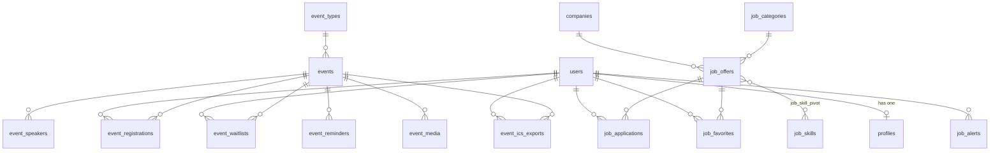

# Base de données — tables et modèles Eloquent

Documentation du schéma métier de la plateforme Laravel CI (Côte d’Ivoire).  
Source : migrations `database/migrations/` et modèles `app/Models/`.

> **Note** : la table `jobs` (migration `0001_01_01_000002`) est réservée à la **file d’attente Laravel**, pas aux offres d’emploi. Les offres sont dans `job_offers`.

---

## Vue d’ensemble (relations)



---

## 1. Utilisateurs et profils

### Table `users`

Comptes membres (connexion OAuth GitHub via Socialite).

| Colonne | Type | Description |
|--------|------|-------------|
| `id` | bigint PK | Identifiant |
| `name` | string | Nom affiché (GitHub) |
| `email` | string unique | Email |
| `avatar` | string nullable | URL avatar GitHub |
| `github_id` | string unique | ID GitHub |
| `github_username` | string unique | Pseudo GitHub |
| `is_active` | boolean default `true` | `false` = banni définitivement |
| `suspended_until` | timestamp nullable | Suspension temporaire jusqu’à cette date |
| `last_login_at` | timestamp nullable | Dernière connexion |
| `email_verified_at` | timestamp nullable | Vérification email |
| `remember_token` | string nullable | Session « se souvenir » |
| `created_at` / `updated_at` | timestamps | Inscription / MAJ |

**Index / contraintes** : `email`, `github_id`, `github_username` uniques.

**Rôles (Spatie)** : `super-admin`, `admin`, `moderateur`, `membre-actif` (table `roles` + pivot `model_has_roles`). Le statut actif/suspendu est géré par les colonnes ci-dessus, pas par un rôle `membre-inactif`.

### Table `profiles`

Profil membre enrichi (sauvegarde progressive, champs nullable).

| Colonne | Type | Description |
|--------|------|-------------|
| `id` | bigint PK | |
| `user_id` | FK → `users` cascade | Propriétaire |
| `avatar` | string nullable | Fichier uploadé (`assets/avatars/`) |
| `pays`, `ville`, `commune` | string nullable | Localisation |
| `biographie` | text nullable | |
| `niveau_laravel` | enum nullable | `debutant`, `intermediaire`, `avance`, `expert`, `maitre` |
| `annees_experience` | enum nullable | `moins_1_an`, `1_3_ans`, `3_5_ans`, `5_10_ans`, `plus_10_ans` |
| `stack_technique` | json nullable | Liste de technologies |
| `niveau_academique` | enum nullable | `bts`, `licence`, `master_ingenieur`, `doctorat` |
| `poste` | enum nullable | `en_fonction`, `etudiant`, `entrepreneur`, `recherche_emploi`, `freelance` |
| `lien_portfolio` | string nullable | |
| `cv` | string nullable | Fichier CV (`assets/cv/`) |
| `created_at` / `updated_at` | timestamps | |

### Table `sessions` (Laravel)

Sessions web : `id`, `user_id`, `ip_address`, `user_agent`, `payload`, `last_activity`. Pas de modèle Eloquent dédié.

---

## 2. Modèle `User` — `App\Models\User`

| Élément | Détail |
|--------|--------|
| **Traits** | `HasFactory`, `Notifiable`, `HasRoles` (Spatie) |
| **Casts** | `email_verified_at`, `last_login_at`, `suspended_until` → datetime ; `is_active` → boolean |
| **Relations** | `profile()` → `HasOne` **Profile** |
| **Scopes** | `active()`, `banned()`, `suspended()` |
| **Helpers** | `isBanned()`, `isSuspended()`, `isActive()`, `suspensionDaysLeft()`, `githubUrl()`, `hasCompletedProfile()` |

---

## 3. Modèle `Profile` — `App\Models\Profile`

| Élément | Détail |
|--------|--------|
| **Casts** | `stack_technique` → array |
| **Relations** | `user()` → `BelongsTo` **User** |
| **Méthodes** | `completionRate()`, `missingFields()`, `avatarUrl()`, `cvUrl()`, labels pour enums (`niveauLaravelLabel()`, etc.) |
| **Constantes** | `$niveauxLaravel`, `$anneesExperience`, `$niveauxAcademiques`, `$postes`, `$stackPredefined` |

---

## 4. Module Événements (M4)

### Table `event_types`

| Colonne | Type |
|--------|------|
| `id` | bigint PK |
| `name` | string |
| `slug` | string unique |

Pas de `timestamps`.

### Table `events`

| Colonne | Type | Description |
|--------|------|-------------|
| `id` | bigint PK | |
| `title` | string | Titre |
| `slug` | string unique | URL (`/events/{slug}`) |
| `description` | longText | |
| `type_id` | FK → `event_types` cascade | Catégorie |
| `location` | string nullable | Lieu physique |
| `meeting_link` | string nullable | Lien visio |
| `start_date` / `end_date` | datetime | Créneau |
| `capacity` | unsigned int nullable | Places max (`null` = illimité) |
| `status` | string(20) default `draft` | Voir **EventStatus** |
| `created_at` / `updated_at` | timestamps | |

**Index** : `status`, `start_date`, `(status, start_date)`.

### Table `event_speakers`

| Colonne | Type |
|--------|------|
| `id` | bigint PK |
| `event_id` | FK → `events` cascade |
| `name` | string |
| `bio` | text nullable |
| `avatar`, `linkedin`, `github` | string nullable |

Index : `event_id`. Pas de `timestamps`.

### Table `event_registrations`

| Colonne | Type |
|--------|------|
| `id` | bigint PK |
| `event_id` | FK → `events` cascade |
| `user_id` | FK → `users` cascade |
| `status` | string(20) default `pending` | **EventRegistrationStatus** |
| `created_at` | timestamp | Pas de `updated_at` |

**Contrainte** : unique `(event_id, user_id)`. Index : `status`.

### Table `event_waitlists`

| Colonne | Type |
|--------|------|
| `id` | bigint PK |
| `event_id` | FK → `events` cascade |
| `user_id` | FK → `users` cascade |
| `position` | unsigned int | Ordre dans la file |
| `created_at` | timestamp | Pas de `updated_at` |

**Contrainte** : unique `(event_id, user_id)`. Index : `(event_id, position)`.

### Table `event_reminders` *(Sprint 2)*

| Colonne | Type |
|--------|------|
| `id` | bigint PK |
| `event_id` | FK → `events` cascade |
| `type` | string(10) | **EventReminderType** : `J-7`, `J-1`, `H-1` |
| `scheduled_at` | datetime | Date d’envoi prévue |
| `sent_at` | timestamp nullable | Envoyé le |

Unique : `(event_id, type)`. Pas de `timestamps`.

### Table `event_media` *(Sprint 2)*

| Colonne | Type |
|--------|------|
| `id` | bigint PK |
| `event_id` | FK → `events` cascade |
| `type` | string(20) | **EventMediaType** : `image`, `video`, `pdf` |
| `url` | string | |
| `created_at` | timestamp | Pas de `updated_at` |

### Table `event_ics_exports` *(Sprint 2)*

| Colonne | Type |
|--------|------|
| `id` | bigint PK |
| `event_id` | FK → `events` cascade |
| `user_id` | FK → `users` cascade |
| `file_path` | string | Chemin fichier `.ics` |
| `created_at` | timestamp | Pas de `updated_at` |

---

## 5. Modèles Événements

### `EventType` — `App\Models\EventType`

- `$timestamps = false`
- `events()` → `HasMany` **Event** (`type_id`)

### `Event` — `App\Models\Event`

| Élément | Détail |
|--------|--------|
| **Route key** | `slug` (`getRouteKeyName()`, `resolveSlug()`) |
| **Casts** | `start_date`, `end_date` → datetime ; `capacity` → int ; `status` → **EventStatus** |
| **Relations** | `type()`, `speakers()`, `registrations()`, `waitlists()`, `reminders()`, `media()`, `icsExports()` |
| **Scopes** | `published()`, `upcoming()`, `past()`, `ofType($slug)` |
| **Métiers** | `confirmedRegistrationsCount()`, `isFull()`, `isUpcoming()`, `isRegisterable()`, `registrationFor($user)`, `waitlistEntryFor($user)`, `toCardData()` |
| **Boot** | Génération auto du `slug` à la création |

### `EventSpeaker` — `App\Models\EventSpeaker`

- Pas de `timestamps`
- `event()` → `BelongsTo` **Event**

### `EventRegistration` — `App\Models\EventRegistration`

- `UPDATED_AT = null`
- Cast `status` → **EventRegistrationStatus**
- `event()`, `user()`

### `EventWaitlist` — `App\Models\EventWaitlist`

- `UPDATED_AT = null` ; cast `position` → int
- `event()`, `user()`

### `EventReminder` — `App\Models\EventReminder`

- Pas de `timestamps` ; casts `type` → **EventReminderType**, dates → datetime
- `event()`

### `EventMedia` — `App\Models\EventMedia`

- `UPDATED_AT = null` ; cast `type` → **EventMediaType**
- `event()`

### `EventIcsExport` — `App\Models\EventIcsExport`

- `UPDATED_AT = null`
- `event()`, `user()`

---

## 6. Enums Événements — `App\Enums\Events\*`

| Enum | Valeurs | Usage |
|------|---------|--------|
| **EventStatus** | `draft`, `published`, `cancelled` | Colonne `events.status` |
| **EventRegistrationStatus** | `pending`, `confirmed`, `cancelled` | `event_registrations.status` |
| **EventReminderType** | `J-7`, `J-1`, `H-1` | `event_reminders.type` |
| **EventMediaType** | `image`, `video`, `pdf` | `event_media.type` |

---

## 7. Module Job Board (M5)

### Table `companies`

| Colonne | Type |
|--------|------|
| `id` | bigint PK |
| `name` | string (index) |
| `description` | text nullable |
| `logo` | string nullable |
| `website` | string nullable |

Pas de `timestamps`.

### Table `job_categories`

| Colonne | Type |
|--------|------|
| `id` | bigint PK |
| `name` | string |
| `slug` | string unique |

### Table `job_skills`

| Colonne | Type |
|--------|------|
| `id` | bigint PK |
| `name` | string |
| `slug` | string unique |

### Table `job_offers`

| Colonne | Type | Description |
|--------|------|-------------|
| `id` | bigint PK | Route : `/jobs/{id}` |
| `company_id` | FK → `companies` cascade | |
| `category_id` | FK → `job_categories` nullable nullOnDelete | |
| `title` | string | |
| `description` | longText | |
| `location` | string nullable | |
| `type` | string(20) | **JobOfferType** |
| `salary` | string nullable | Affichage libre |
| `deadline` | date nullable | Date limite candidature |
| `status` | string(20) default `draft` | **JobOfferStatus** |
| `created_at` | timestamp | Pas de `updated_at` |

**Index** : `status`, `type`, `deadline`, `(company_id, status)`.

### Table `job_skill_pivot`

Table pivot N–N (pas de modèle Eloquent).

| Colonne | Contrainte |
|--------|------------|
| `job_offer_id` | FK → `job_offers` cascade |
| `job_skill_id` | FK → `job_skills` cascade |
| **PK** | `(job_offer_id, job_skill_id)` |

### Table `job_applications`

| Colonne | Type |
|--------|------|
| `id` | bigint PK |
| `job_offer_id` | FK → `job_offers` cascade |
| `user_id` | FK → `users` cascade |
| `cv_path` | string nullable |
| `cover_letter` | text nullable |
| `status` | string(20) default `pending` | **JobApplicationStatus** |
| `created_at` | timestamp | Pas de `updated_at` |

Unique : `(job_offer_id, user_id)`.

### Table `job_favorites` *(Sprint 2)*

| Colonne | Type |
|--------|------|
| `id` | bigint PK |
| `job_offer_id` | FK cascade |
| `user_id` | FK cascade |
| `created_at` | timestamp |

Unique : `(job_offer_id, user_id)`.

### Table `job_alerts` *(Sprint 2)*

| Colonne | Type |
|--------|------|
| `id` | bigint PK |
| `user_id` | FK → `users` cascade |
| `keywords` | string nullable |
| `location` | string nullable |
| `type` | string(20) nullable | **JobOfferType** |
| `is_active` | boolean default `true` |

Index : `(user_id, is_active)`. Pas de `timestamps`.

---

## 8. Modèles Jobs

### `Company` — `App\Models\Company`

- Pas de `timestamps`
- `jobOffers()` → `HasMany` **JobOffer**

### `JobCategory` — `App\Models\JobCategory`

- Pas de `timestamps`
- `jobOffers()` → `HasMany` **JobOffer** (`category_id`)

### `JobSkill` — `App\Models\JobSkill`

- Pas de `timestamps`
- `jobOffers()` → `BelongsToMany` via `job_skill_pivot`

### `JobOffer` — `App\Models\JobOffer`

| Élément | Détail |
|--------|--------|
| **Table** | `job_offers` |
| **Timestamps** | `UPDATED_AT = null` (seulement `created_at`) |
| **Casts** | `type` → **JobOfferType** ; `status` → **JobOfferStatus** ; `deadline` → date ; `created_at` → datetime |
| **Relations** | `company()`, `category()`, `applications()`, `favorites()`, `skills()` (many-to-many) |
| **Scopes** | `active()` — statut `active` + deadline non dépassée |
| **Métiers** | `isPubliclyVisible()`, `isApplyable()`, `isWithinDeadline()`, `applicationFor($user)`, `toCardData()` |

### `JobApplication` — `App\Models\JobApplication`

- `UPDATED_AT = null` ; cast `status` → **JobApplicationStatus**
- `jobOffer()`, `user()`

### `JobFavorite` — `App\Models\JobFavorite`

- `UPDATED_AT = null`
- `jobOffer()`, `user()`

### `JobAlert` — `App\Models\JobAlert`

- Pas de `timestamps` ; casts `type` → **JobOfferType**, `is_active` → boolean
- `user()`

---

## 9. Enums Jobs — `App\Enums\Jobs\*`

| Enum | Valeurs | Usage |
|------|---------|--------|
| **JobOfferStatus** | `active`, `expired`, `draft` | `job_offers.status` — expiration auto (commande scheduler) passe en `expired` |
| **JobOfferType** | `cdi`, `freelance`, `remote`, `stage` | `job_offers.type`, `job_alerts.type` |
| **JobApplicationStatus** | `pending`, `accepted`, `rejected` | `job_applications.status` |

---

## 10. Permissions Spatie

Tables standard [spatie/laravel-permission](https://github.com/spatie/laravel-permission) :

| Table | Rôle |
|-------|------|
| `permissions` | Permissions nommées |
| `roles` | Rôles (`guard_name` = `web`) |
| `model_has_permissions` | Permissions directes sur modèles |
| `model_has_roles` | Rôles assignés aux utilisateurs |
| `role_has_permissions` | Permissions par rôle |

Modèle utilisé : `Spatie\Permission\Models\Role` (config `config/permission.php`). Le modèle **User** utilise le trait `HasRoles`.

---

## 11. Tables infrastructure Laravel

| Table | Rôle |
|-------|------|
| `cache` / `cache_locks` | Cache applicatif |
| `jobs` / `job_batches` / `failed_jobs` | Queue asynchrone (pas lié au job board) |

---

## 12. Récapitulatif modèle ↔ table

| Modèle Eloquent | Table SQL | Factory | Sprint |
|-----------------|-----------|---------|--------|
| `User` | `users` | ✅ | Fondations |
| `Profile` | `profiles` | ✅ | Fondations |
| `EventType` | `event_types` | ✅ | M4 |
| `Event` | `events` | ✅ | M4 |
| `EventSpeaker` | `event_speakers` | ✅ | M4 |
| `EventRegistration` | `event_registrations` | ✅ | M4 |
| `EventWaitlist` | `event_waitlists` | ✅ | M4 |
| `EventReminder` | `event_reminders` | — | Sprint 2 |
| `EventMedia` | `event_media` | — | Sprint 2 |
| `EventIcsExport` | `event_ics_exports` | — | Sprint 2 |
| `Company` | `companies` | ✅ | M5 |
| `JobCategory` | `job_categories` | ✅ | M5 |
| `JobSkill` | `job_skills` | ✅ | M5 |
| `JobOffer` | `job_offers` | ✅ | M5 |
| — | `job_skill_pivot` | — | M5 (pivot) |
| `JobApplication` | `job_applications` | ✅ | M5 |
| `JobFavorite` | `job_favorites` | — | Sprint 2 |
| `JobAlert` | `job_alerts` | — | Sprint 2 |

---

## 13. Seeders et données de démo

| Seeder | Contenu |
|--------|---------|
| `RoleSeeder` | Rôles Spatie |
| `UserSeeder` | Comptes de test |
| `EventTypeSeeder`, `EventSeeder` | Types et événements |
| `JobSeeder` | Entreprises, catégories, compétences, offres |
| `SprintRogerSeeder` | Orchestration seed sprint (events + jobs + membre test) |

Commande typique :

```bash
php artisan migrate:fresh --seed
# ou avec DDEV :
ddev exec php artisan migrate:fresh --seed
```

---

## 14. Fichiers de référence

| Chemin | Contenu |
|--------|---------|
| `database/migrations/` | Schéma SQL |
| `app/Models/` | Modèles Eloquent |
| `app/Enums/Events/` | Enums événements |
| `app/Enums/Jobs/` | Enums emploi |
| `database/factories/` | Factories Pest / seed |
| `database/seeders/` | Jeux de données |

*Document généré pour le module Roger (Sprint 1 — M4 Événements, M5 Job Board).*
